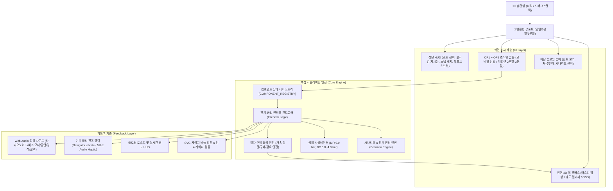

# 📋 1. 프로젝트 개요 (Project Overview)

## 1. 개발 배경 및 목적
철도 차량의 운전실 조작반은 복잡한 전기 회로와 공압 배관, 다양한 안전 보호 인터록(Interlock) 장치로 얽혀 있습니다. 
기관사 및 승무원이 실제 비상 상황(비상제동 체결, 구원운전, 차단기 트립, VOBC 리셋, 무인운전 인가 등)에서 신속하고 정확하게 대응하기 위해서는 반복적인 훈련이 필수적입니다.

그러나 실제 전동차를 기지에 유치하여 훈련하기에는 시공간적 한계와 비용이 발생합니다. 본 프로젝트는 **언제 어디서나 웹 브라우저(모바일, 태블릿, PC)만으로 실제 열차 운전실과 100% 동일한 조작 감각 및 연동 논리를 체득할 수 있는 고정밀 훈련 시뮬레이터**를 구축하는 것을 목표로 합니다.

---

## 2. 주요 설계 원칙

### ① 1:1 사진 기반 극사실적 비주얼 고증 (Photorealistic)
* 실제 전동차 운전실 실물 사진을 토대로 조작반 프레임, 볼트 고정 위치, 우측 상단 모서리 사선 절단면(Chamfer), 챔퍼 테두리 핀스트라이프 라인까지 픽셀 단위로 구현
* 금속 질감(Metallic Texture), 헤어라인 알루미늄 명판, 황동(Brass) 키 실린더, 투명 아크릴 힌지 안전커버 등 재질감 극대화
* 부품의 물리적 움직임(3-Arrow 버섯형 비상제동 버튼의 쑥 들어가는 래치, 누름 해제 시 30도 회전 튀어나옴, 대형 블랙 구형 볼 노브 역전기, T자형 원핸들 마스콘) 시각화

### ② 실물 사진 마스킹 기반 3D 전면 주행 시뮬레이터
* 사용자 제공 실제 운전실 사진(`cab_view.png`)의 전면 유리창 개구부를 정밀 마스킹(`cvWindowPath`)하여 차체 프레임 너머로 3차원 선로가 펼쳐지도록 구성
* 표준 궤간(1,435mm), 침목, 도상 자갈, 전차선 가선주, 선로변 방음벽, 울타리, 수목 및 도심 빌딩 3차원 원근 투영
* 인천 2호선 8개 역 승강장 진입/통과, 터널 진입 시 암전 및 조명 연동, 강우 및 와이퍼 빗방울 닦임 물리 효과
* 주행 속도에 따른 차체 진동, 캔트 롤링(Sway), 인버터 구동음 및 25m 주기 레일 이음매 충격음(Clack) 합성

### ③ 타협 없는 인터록(Interlock) 논리 구현
* **운전모드 `OFF` 상태 인터록**: 운전모드가 OFF일 때는 제어키를 ON으로 돌릴 수 없으며, 역전기(F/R) 및 마스콘(P/B) 조작이 기계적으로 차단됨
* **무인운전모드(ATO) 인가 4대 조건**: `운전모드 OFF + 제어키 OFF + 역전기 N + 마스콘 N` 상태에서 커버 오픈 후 3초 이상 롱프레스 시 녹색 점등(`LIT`) 및 60 km/h 자동 순항 가동
* **수동 운전 조건(FM, RM, ATPM)**: 수동 모드에서만 키 ON 및 레버 수동 운전 가능. RM(제한수동) 모드는 최고속도 25 km/h 자동 제한
* **선두차지정 점등 연동**: `운전모드(RM/FM/ATPM) + 키(ON) + 역전기(F/R)` 3가지 조건이 모두 만족해야만 황색 점등
* **마스콘 EB 연동**: 비상제동 노치(EB) 투입 시 OP2 제동체결등 점등 및 제동통(BC) 4.0 bar 가압 연동
* **VOBC 리셋 롱프레스 취급**: 2~3초 누름 시 해당차 재설정 / 5~7초 누름 시 전·후부 VOBC 전체 리셋 및 타임아웃 경고

### ④ 순수 웹 기술 (Zero Dependency)
* 별도의 무거운 3D 엔진(Unity, Three.js)이나 대용량 오디오 파일 없이, **순수 HTML5, Canvas 2D, CSS3, JavaScript, SVG, Web Audio API**만으로 제작되어 즉시 로딩 완료
* 네트워크가 느리거나 오프라인인 환경에서도 완전하게 단독 실행 가능

---

## 3. 시스템 아키텍처 다이어그램

