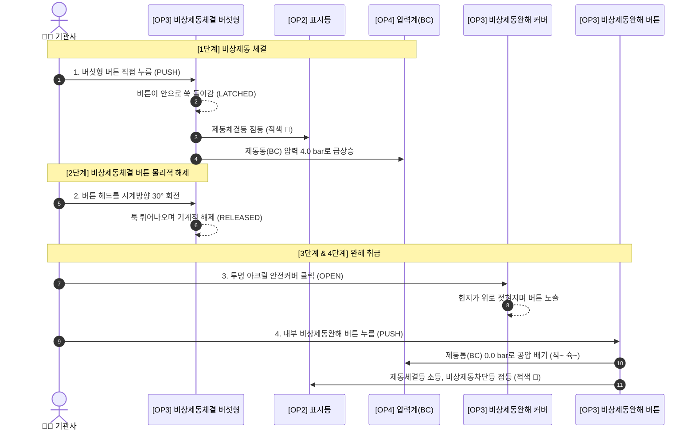

# 📖 3. 운전 취급 절차 매뉴얼 (Operating Manual)

본 매뉴얼은 실제 도시철도 운전 취급 규정에 기반하여 본 시뮬레이터에서 연습할 수 있는 핵심 절차와 인터록 제약 사항을 기술합니다.

---

## 1. 운전모드 `OFF` 상태 인터록 및 무인운전(ATO) 가동 절차

운전모드가 `OFF`일 때의 운전대 보호 인터록과 3초 롱프레스를 통한 무인운전 인가 표준 절차입니다.

### ① 운전모드 `OFF` 인터록 (운전대 잠금)
* 운전모드가 `OFF`인 상태에서는 기관사 수동 조작을 차단하기 위해 **제어키 ON 불가**, **전후진제어기(F/R) 조작 불가**, **마스콘(P1~P4, B1~B7, EB) 조작 불가** 인터록이 작동합니다.
* 운전모드를 `OFF`로 전환하면 기존에 투입되어 있던 제어키는 `OFF`로, 역전기 및 마스콘은 `N`(중립)으로 강제 복귀합니다.

### ② 무인운전모드(ATO) 인가 4대 선행조건 및 3초 롱프레스
무인운전(ATO)을 가동하기 위해서는 반드시 아래의 **4대 선행조건**이 충족되어야 합니다.

```
[운전모드 = OFF] ──┐
[제어키 = OFF]   ──┼─► [OP3 무인모드 투명 안전커버 OPEN] ─► [버튼 3초 롱프레스] ─► [ATO 무인운전 가동!]
[역전기 = N]     ──┤                                                        (60 km/h 자동 주행)
[마스콘 = N]     ──┘
```

1. OP2 운전모드가 `OFF` 위치일 것
2. OP2 제어키가 `OFF` 위치일 것
3. OP1 전후진제어기가 `N`(중립) 위치일 것
4. OP1 마스콘 핸들이 `N`(중립) 위치일 것
5. **취급 요령**:
   - OP3 `SW_WIRELESS_COVER`(무인모드 안전커버)를 클릭하여 엽니다.
   - 내부 녹색 푸시버튼(`SW_WIRELESS_MODE`)을 3초 이상 누르고 있으면 원형 프로그레스가 충전되며 녹색 불(`LIT`)이 점등합니다.
   - 점등 즉시 열차가 자동으로 역행하여 **60 km/h 목표 속도로 자동 순항 주행**을 시작합니다.
   - 전면 모니터 OSD에는 `ATO 무인` 노치 태그와 `무인운전 (ATO)` 상태 배지가 표시됩니다.
   - 4대 조건 중 하나라도 미충족 시 버튼을 눌러도 충전되지 않으며 미충족 안내 토스트가 출력됩니다.

---

## 2. 수동 운전 모드 (`FM`, `RM`, `ATPM`) 취급 절차

기관사가 직접 열차를 수동으로 조작하여 역행/제동하기 위한 절차입니다.

1. **운전 모드 전환**:
   * OP2 `SW_DRIVE_MODE`를 `FM`(완전 수동), `RM`(제한 수동), `ATPM`(신호 수동) 중 하나로 회전시킵니다.
   * 수동 모드로 진입하면 가동 중이던 무인운전(ATO)은 안전을 위해 즉시 자동 해제됩니다.
2. **제어키 투입**:
   * 운전모드가 수동 모드인 상태에서만 OP2 제어키를 `ON` 위치로 돌릴 수 있습니다.
3. **전후진제어기 투입**:
   * 제어키가 `ON`인 상태에서 OP1 역전기 노브를 `F`(전진) 또는 `R`(후진)으로 설정합니다.
   * 역전기가 `F` 또는 `R`에 들어가면 OP2 `선두차지정` 황색등이 점등됩니다.
4. **마스콘 핸들 조작**:
   * 출입문이 닫히고(`lamp-door` 점등), 제동통 압력이 0.5 bar 미만인 상태에서 마스콘을 `P1`~`P4`로 당기면 열차가 부드럽게 가속합니다.
   * **RM(제한수동) 모드 속도 제한**: RM 모드에서는 P4로 최대로 당겨도 열차 속도가 **25 km/h로 자동 제한**됩니다.

---

## 3. 주행 속도 폭주 방지 및 안전 감속 논리

시뮬레이터 물리 엔진에는 오조작이나 내리막 구배로 인한 탈선 및 무제한 가속을 방지하는 삼중 안전장치가 내장되어 있습니다.

1. **내리막 구배 가속 캡핑**:
   * 내리막 구간(음의 구배, `gradeAcc > 0`)에서도 열차 속도는 현재 마스콘 노치의 목표 속도(`target`)를 초과하여 가속되지 않도록 `Math.min(target, ...)`으로 고정됩니다.
2. **고속 ➔ 저속 모드 전환 시 안전 감속력 보장**:
   * FM(80 km/h)으로 고속 주행 중 RM(25 km/h)으로 운전모드를 전환하거나 P노치를 내렸을 때, `decel = Math.min(rate, -2.5)` 감속력을 보장하여 `Math.max(target, ...)`로 확실하게 감속 수렴합니다.
3. **운전 모드별 절대 상한선 (Absolute Limit)**:
   * `RM` 모드: 25.0 km/h 절대 상한선
   * `FM` / `ATPM` 모드: 80.0 km/h 절대 상한선
   * 물리적 외란으로 상한선을 초과하는 즉시 초당 5.0 km/h의 강제 제동력이 인가되어 규정 속도 내로 신속히 복귀합니다.

---

## 4. 비상제동 체결 및 완해 표준 절차 (4단계)



1. **[1단계] 비상제동 체결**: OP3 적색 버섯형 버튼 누름 ➔ BC 4.0 bar 가압, [제동체결] 적색등 점등
2. **[2단계] 비상제동체결 버튼 해제**: 버섯형 헤드 재클릭 시 시계방향 회전하며 튀어나옴
3. **[3단계] 완해 안전커버 열기**: OP3 비상제동완해 투명 커버 클릭하여 개방
4. **[4단계] 완해 버튼 누름**: 내부 적색 버튼 클릭 ➔ 1초 공압 배기음과 함께 BC 0.0 bar 완해 및 [비상제동차단] 점등

---

## 5. 선두차지정 표시등 점등 조건

OP2 상부의 노란색 **`선두차지정`** 표시등은 아래의 **3가지 조건이 동시에 충족될 때만** 점등됩니다.

$$\text{선두차지정 점등} \iff (\text{운전모드} \in \{\text{RM}, \text{FM}, \text{ATPM}\}) \land (\text{제어키} = \text{ON}) \land (\text{역전기} \in \{\text{F}, \text{R}\})$$

* 운전 모드가 `OFF`인 경우 ➔ **소등**
* 수동 운전 모드(RM/FM/ATPM)이더라도 제어키가 `OFF`이거나 역전기가 `N`(중립)이면 ➔ **소등**
* 수동 모드 + 키 ON + 역전기를 `F`나 `R`로 넣는 순간 ➔ **즉시 황색 🟡 점등**

---

## 6. VOBC 리셋 버튼 롱프레스 취급 요령

* OP5의 `SW_VOBC_RESET`(노란색 버튼)을 길게 누르는 시간에 따라 차상 신호 리셋 범위가 달라집니다:
  * **2.0초 ~ 3.0초**: 해당차 단독 VOBC 리셋 진행
  * **5.0초 ~ 7.0초**: 전·후부 VOBC 전체 리셋 진행
  * **7.0초 초과**: 리셋 타임아웃 경고 발생
